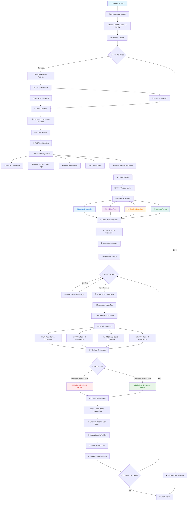
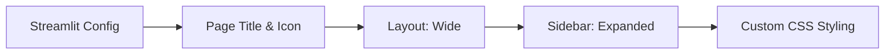
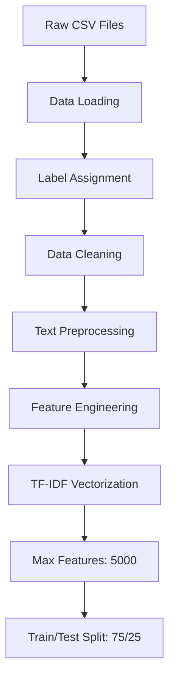
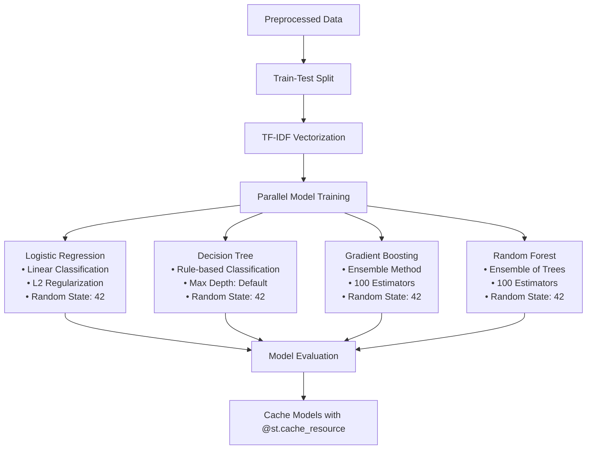
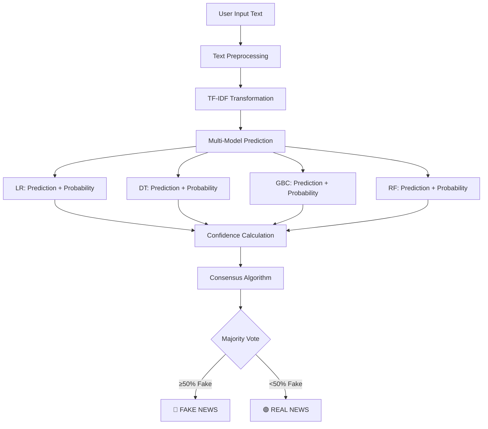
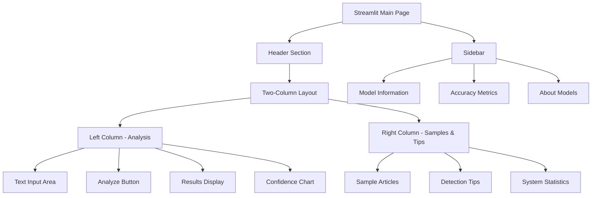
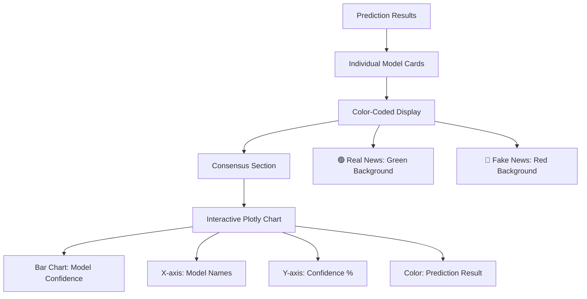
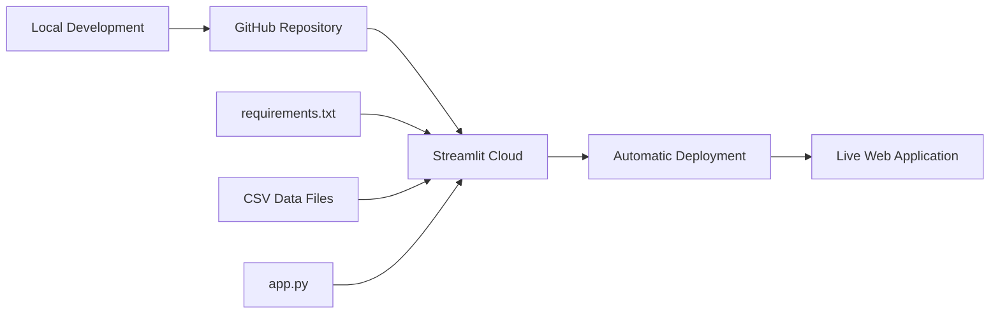

# Fake News Detection System - Flowchart

## System Architecture & Workflow Diagram

## Detailed Component Breakdown

### 1. 📱 Application Initialization

### 2. 🗄️ Data Pipeline

### 3. 🤖 Model Training Pipeline

### 4. 🔍 Prediction Workflow

### 5. 🎨 UI Components Structure

### 6. 📊 Results Display System

## 🔧 Technical Architecture

### Performance Optimizations
- **@st.cache_data**: Caches dataset loading
- **@st.cache_resource**: Caches trained models
- **Lazy Loading**: Models load only when needed
- **Efficient Vectorization**: TF-IDF with limited features

### Error Handling
- CSV file validation
- Model training error catching
- Input text validation
- Graceful degradation on failures

### Scalability Features
- Modular function design
- Configurable model parameters
- Extensible model architecture
- Deployment-ready structure

## 🚀 Deployment Flow
